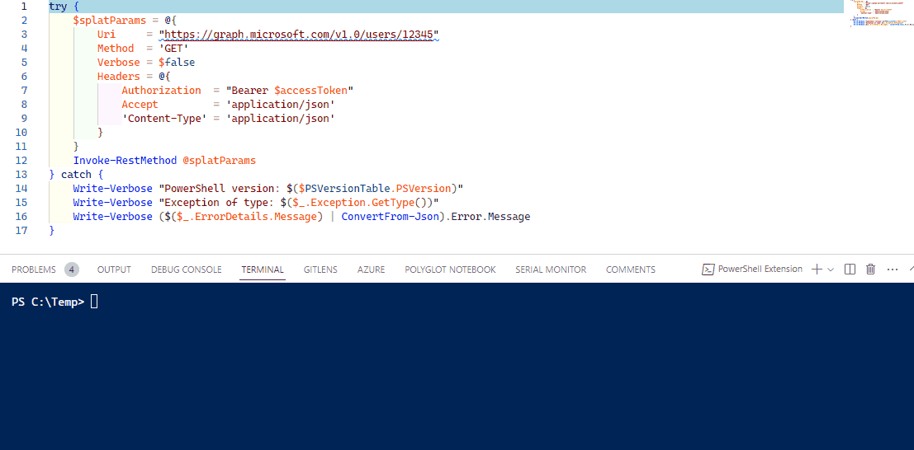
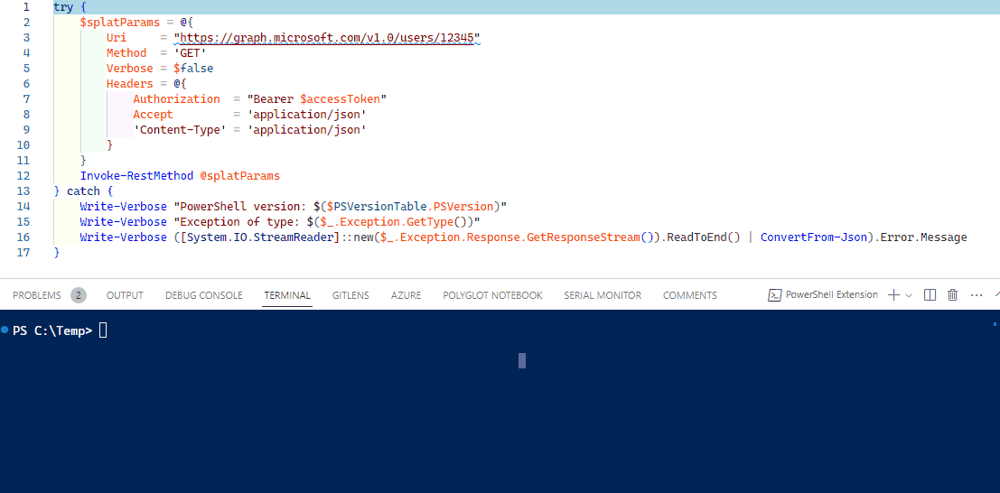

## Introduction
Have you ever spent hours trying to track down a bug in your PowerShell connector, only to realize that you missed an error in your code?

Error handling is one of the most critical aspects of building reliable and robust PowerShell connectors for HelloID, yet it's often overlooked. If you're working with REST APIs in PowerShell, error handling becomes even more important but unfortunately, it also increases complexity.

In this blog post, we'll explore the basics of error handling in PowerShell and provide some best practices for handling REST API errors. We'll cover common types of errors you may encounter, such as HTTP 404 errors and authentication errors, and show you how to log errors and create custom error messages.

By the end of this post, you'll have a clear understanding of how to handle REST API errors like a pro. So, grab a cup of coffee and let's dive in!"

## Try/Catch

Your code, at some point, will likely generate errors or exceptions under a certain condition. For example, if you're working with a file and the file doesn't exist, reading the file could cause an error. In order to handle such an error, PowerShell provides a `try/catch` statement. The `try` block monitors the code you are executing. If an error occurs, the `catch` block will, quite literally, catch the error and act accordingly.

In the code example below, a try block is defined to attempt to read a folder that does not exist. If an error occurs, the catch block is triggered and outputs a message showing the error: Error occurred: $($_.Exception.Message)."


try {
    Get-Content c:\doesnotexist
} catch {
    "Error occurred: $($_.Exception.Message)"
}


Since the file path specified in Get-Content does not exist, an error will be thrown and caught by the catch block, which will then output the error message as specified.


Error occurred: Cannot find path 'C:\doesnotexist' because it does not exist.


## Handling REST API errors

### Exception types

First of all, both _Windows PowerShell_ and _PowerShell Core_ will throw different exception types. This is because they are built in different versions of _.NET_ but also, use different methods of intereacting with web requests. _Windows PowerShell_ uses the older `System.Net.WebRequest`, whereas _PowerShell Core_ uses the newer `System.Net.HttpClient` and because of this, both will throw different exception types.

| PowerShell version | .NET version | Method | Exception type |
| --- | --- | --- | --- |
| Windows PowerShell | .NET FrameWork | `System.Net.WebRequest` | `System.Net.WebException` |
| PowerShell Core | .NET Core | `System.Net.HttpClient` |`Microsoft.PowerShell.Commands.HttpResponseException`

### `$_.ErrorDetails`

Error messages returned by the API can typically be found in the `$_.ErrorDetails` object. In most cases, this object contains a JSON that includes the error message.

#### But, not on _Windows PowerShell_

Because in many cases on _Windows PowerShell_ the `$_.ErrorDetails` object will be empty. To work around this issue, you will have to retrieve the error response stream.

##### ResponseStream code example

[System.IO.StreamReader]::new($_.Exception.Response.GetResponseStream()).ReadToEnd()


## Best practices

### PowerShell Core

When working with _PowerShell Core_, it's generally a good practice to use the `$_.ErrorDetails` object to handle errors returned from an API.

#### Example


try {
    $splatParams = @{
        Uri     = "https://graph.microsoft.com/v1.0/users/12345"
        Method  = 'GET'
        Verbose = $false
        Headers = @{
            Authorization  = "Bearer $accessToken"
            Accept         = 'application/json'
            'Content-Type' = 'application/json'
        }
    }
    Invoke-RestMethod @splatParams
} catch {
    Write-Verbose "PowerShell version: $($PSVersionTable.PSVersion)"
    Write-Verbose "Exception of type: $($_.Exception.GetType())"
    Write-Verbose ($($_.ErrorDetails.Message) | ConvertFrom-Json).Error.Message
}


In the code block above, executes the following steps:

1. Define a hashtable called `splatParams`. The keys of the hash table represent the properties of the `Invoke-RestMethod` cmdlet.

2. Retrieve a user with id `12345` that does not exists. Meaning, this request will generate an exception.

3. When we hit the `catch` block, write a verbose message for the `$PSVersionTable.PSVersion` and `$_.Exception.GetType()`

4. Grab the error response from `$_.ErrorDetails.Message`, convert it to an object, and obtain the `Error.Message` and write that to the __verbose__ stream.

Let see it in action:

As you can see, we have an error stating that the resource with name `12345` does not exists. Which is exactly what we want to see.

### Windows PowerShell

In many cases, the `$_ErrorDetails` object may be empty. So when working with _Windows PowerShell 5.1_, it's generally a good practice to use the [error response stream](#responsestream-code-example) to handle errors returned from an API. By using the error response stream, you can ensure that you have access to the full range of error information returned by the API.

#### Example


try {
    $splatParams = @{
        Uri     = "https://graph.microsoft.com/v1.0/users/12345"
        Method  = 'GET'
        Verbose = $false
        Headers = @{
            Authorization  = "Bearer $accessToken"
            Accept         = 'application/json'
            'Content-Type' = 'application/json'
        }
    }
    Invoke-RestMethod @splatParams
} catch {
    Write-Verbose "PowerShell version: $($PSVersionTable.PSVersion)"
    Write-Verbose "Exception of type: $($_.Exception.GetType())"
    Write-Verbose ([System.IO.StreamReader]::new($_.Exception.Response.GetResponseStream()).ReadToEnd() | ConvertFrom-Json).Error.Message
}


In the code block above, we retrieve the error response using the `[System.IO.StreamReader]::new($_.Exception.Response.GetResponseStream()`, convert it to an object, and obtain the `Error.Message` and write that to the __verbose__ stream.

Let see it in action:

As you can see, we have an error stating that the resource with name `12345` does not exists. Which is exactly what we want to see.

## Summary

| PowerShell version | Best Practice | Exception type |
| --- | --- | --- |
| Windows PowerShell | Always use the error response stream to handle errors returned from an API. | `System.Net.WebException` |
| PowerShell Core | Always use the `$_.ErrorDetails` object to handle errors returned from an API. | `Microsoft.PowerShell.Commands.HttpResponseException`